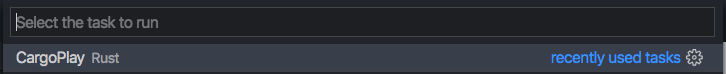

# cargo-play

[](https://travis-ci.org/fanzeyi/cargo-play) 

`cargo-play` is a tool to help you running your Rust code file without manually setting up a Cargo project.

## See it in action


## Install

```
cargo install cargo-play
```

## Usage

Simply running `cargo play <files>` is sufficient. You can specify your external dependency at the
beginning of your file with the prefix `//#`. It accepts the same TOML syntax as in `Cargo.toml`.

## Example

```rust
$ cat serde_json.rs
//# serde_json = "*"

use serde_json::{Result, Value};

fn main() -> Result<()> {
    // Some JSON input data as a &str. Maybe this comes from the user.
    let data = r#"
        {
            "name": "John Doe",
            "age": 43,
            "phones": [
                "+44 1234567",
                "+44 2345678"
            ]
        }"#;

    // Parse the string of data into serde_json::Value.
    let v: Value = serde_json::from_str(data)?;

    // Access parts of the data by indexing with square brackets.
    println!("Please call {} at the number {}", v["name"], v["phones"][0]);

    Ok(())
}

$ cargo play serde_json.rs
    Updating crates.io index
   Compiling serde v1.0.91
   Compiling ryu v0.2.8
   Compiling itoa v0.4.4
   Compiling serde_json v1.0.39
   Compiling gvzcg8yviqmd_euq3xti4-zbkrs v0.1.0 (/var/folders/nq/608n9lcx02n_mzx33_3z5wyw0000gn/T/cargo-play.GVzCg8yviQmd_EUq3Xti4-ZbKRs)
    Finished dev [unoptimized + debuginfo] target(s) in 10.23s
     Running `/var/folders/nq/608n9lcx02n_mzx33_3z5wyw0000gn/T/cargo-play.GVzCg8yviQmd_EUq3Xti4-ZbKRs/target/debug/gvzcg8yviqmd_euq3xti4-zbkrs`
Please call "John Doe" at the number "+44 1234567"
```

It also supports running multiple files at the same time:

```rust
$ cat tests/multi/entry.rs
mod hello;

fn main() {
    println!("Hello {}", hello::world());
}
$ cat tests/multi/hello.rs
pub fn world() -> String {
    "World".into()
}
$ cargo play tests/multi/*
   Compiling qvsjdw04fxh5cgpdkdvg6ite_ak v0.1.0 (/var/folders/nq/608n9lcx02n_mzx33_3z5wyw0000gn/T/cargo-play.QVSJDw04FxH5CGpDkDvg6itE_ak)
    Finished dev [unoptimized + debuginfo] target(s) in 0.30s
     Running `/var/folders/nq/608n9lcx02n_mzx33_3z5wyw0000gn/T/cargo-play.QVSJDw04FxH5CGpDkDvg6itE_ak/target/debug/qvsjdw04fxh5cgpdkdvg6ite_ak`
Hello World
```

Files under sub-directories will be copied and placed relatively to the first file. Try:

    cargo play tests/subdirs/**/*.rs

## To Do

- [ ] Editor plugins
  - [x] Vim
  - [ ] VS Code
- [x] Toolchain supports
- [x] Edition Support

## Editor Support

### Vim

Add this line to your `.vimrc` or `init.vim`:

```vim
command! CargoPlay !cargo play %
```

With your code file open, running `:CargoPlay` will allow you to test your current file within an auto-generated cargo project.

### VSCode

Open Command Palette and select **Configure Task**
- *This will either create a new tasks.json or open your existing tasks.json*

Add the following task:

```json
{
    "version": "2.0.0",
    "tasks": [
        {
            "type": "shell",
            "label": "CargoPlay",
            "command": "cargo",
            "args": [
                "play",
                "${file}",
            ],
            "problemMatcher": [
                "$rustc"
            ]
        }
    ]
}
```

Now open the Command Palette, select **Run Task** and then run the new **CargoPlay** task



### Micro

add this to your [micro](https://micro-editor.github.io/) `~/.config/micro/init.lua`

```lua
local config = import("micro/config")

function init()
    config.TryBindKey("Alt-b", "lua:initlua.play", true)
    config.MakeCommand("cargoplay", play, config.NoComplete)
end

function play(bp)

    bp:Save()
    
    if bp.Buf:FileType() == "rust" then
        shell.RunInteractiveShell("cargo play " .. bp.Buf.Path, true, false)
    end
end

```

Then you can hit **Alt** + **b** to __build__ your current file usig `cargo play` or you can use **Ctrl** + **E** and in the command console type **cargoplay**


## Acknowledgements

This project is inspired by [play.rust-lang.org](https://play.rust-lang.org) and [RustPlayground](https://github.com/cmyr/RustPlayground).
