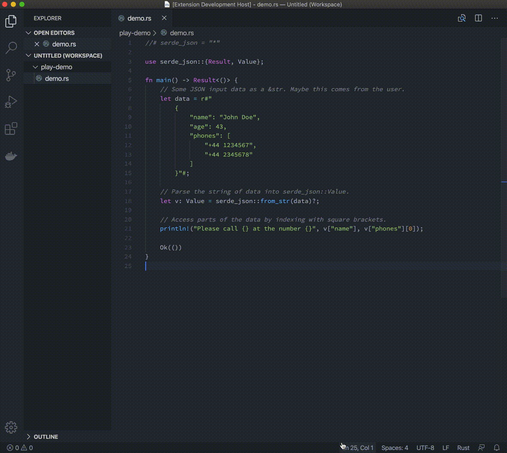

# cargo-play VSCode Extension



## Features

- CargoPlay: Run
  - Run the current Rust file in a CargoPlay playground [Usage instructions](../README.md#usage)

- CargoPlay: Install
  - Install the cargo-play Cargo extension (only needs to be done once)

## Requirements

- Installation of [Rustup](https://rustup.rs/) and `cargo` in your `$PATH`

## Installation

Install from Github:
```
$ git clone https://github.com/fanzeyi/cargo-play
$ code --install-extension cargo-play/extension/cargo-play-0.0.1.vsix
```

## Known Issues

- At least one folder must be added to the workspace
- The extension is not aware of `cargo play` being installed or not


## Release Notes

### 1.0.0

Initial release of Cargo-Play extension, supports:
- CargoPlay installation
- Quick access to CargoPlay playground feature of running Rust files
